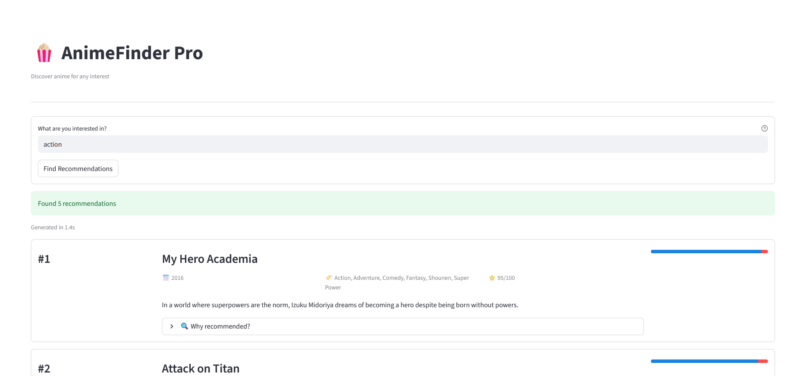
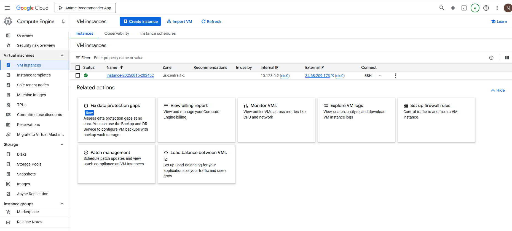
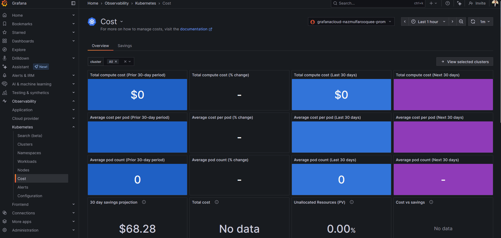

# 🎌 Anime Recommender System – LLMOps Project

Welcome to the **Anime Recommender System** powered by LLMOps! This project showcases an end-to-end deployment pipeline using cutting-edge tools including Docker 🐳, Kubernetes ☸️, Google Cloud ☁️, and Grafana 📊 for cloud-native monitoring.

---

## 🚀 Project Overview

This application provides intelligent anime recommendations using LLM and vector search. It demonstrates:

- ⚙️ Local development with Python
- 🐳 Containerization using Docker
- ☸️ Deployment with Kubernetes on a Google Cloud VM
- 🔐 Secrets management via Kubernetes
- 📈 Monitoring with Grafana Cloud
- ✅ CI/CD-ready structure

---

## 🛠️ Tech Stack

| Tool        | Purpose                            |
|-------------|------------------------------------|
| Python 🐍   | Core development                    |
| Docker 🐳   | Containerization                    |
| Kubernetes ☸️ | Orchestration                      |
| Google Cloud ☁️ | Infrastructure hosting          |
| Minikube    | Local Kubernetes environment       |
| Grafana 📊  | Observability & Monitoring          |

---

## 📂 Project Structure

```
.
├── app/
├── config/
├── chroma_db/
├── data/
├── pipeline/
├── src/
├── utils/
├── .gitignore
├── Dockerfile
├── llmops-k8s.yaml
├── requirements.txt
├── setup.py
└── README.md
```

---

## 🚧 Deployment Instructions

For a detailed deployment guide, please refer to [Anime_project_docs.md](Anime_project_docs.md).

It includes:

- GitHub setup 🧑‍💻
- Docker installation & build ⚙️
- Kubernetes + Minikube setup ☸️
- Google Cloud VM provisioning ☁️
- Helm & Grafana integration 📈

---

---

## 📸 Screenshots

Here are a few snapshots of the deployed Anime Recommender System in action:

### 🎯 1. Application UI – AnimeFinder Pro



---

### ☁️ 2. Google Cloud VM Instance

This VM hosts our Kubernetes cluster running the recommender system:



---

### 📊 3. Grafana Cloud – Cost Monitoring

We use Grafana to monitor infrastructure usage and cost:



---

### 📈 4. Kubernetes Observability in Grafana

Live metrics showing CPU, memory, workloads, and pod details:


---

---


## 👨‍💻 Author

- **Name:** Nazmul Mustufa Farooquee
- **GitHub:** [Najam0786](https://github.com/Najam0786)
- **Email:** [nazmulfarooquee@gmail.com](mailto:nazmulfarooquee@gmail.com)

---

## 🌐 License

This project is licensed under the MIT License - feel free to use, modify, and share!